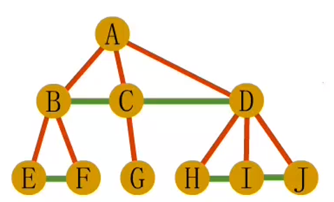
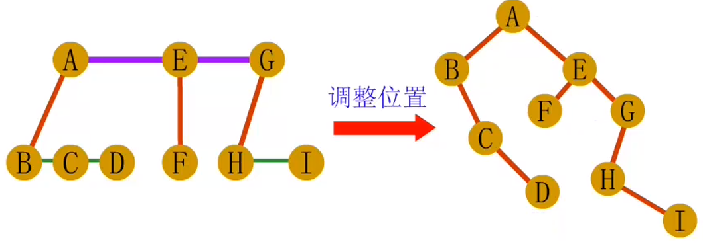
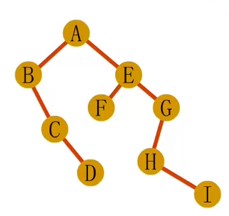
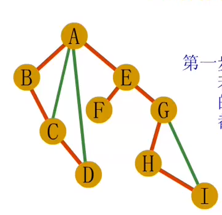
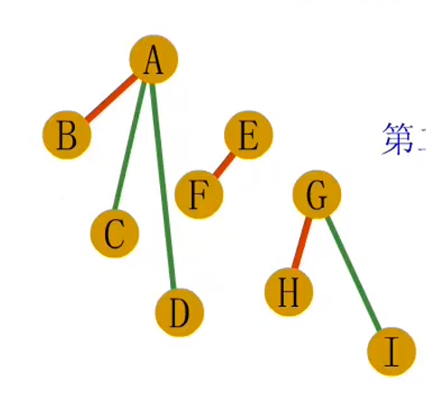
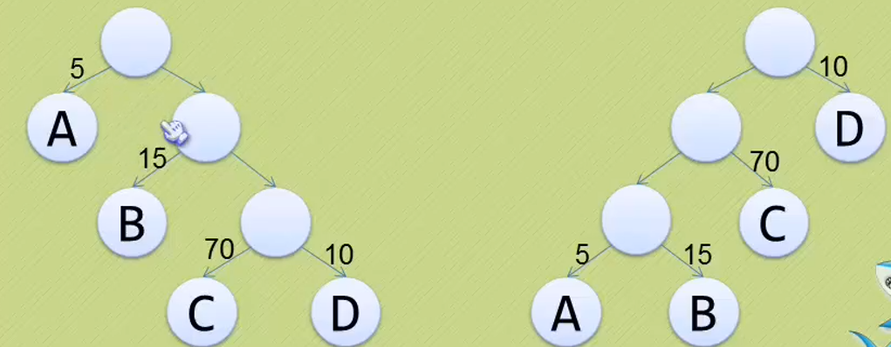
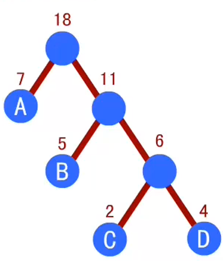

# 树

## 分类

* 有序树：从左至右的结点按照次序排列
* 无序树：与有序树相对

* 森林：多棵互不相交的树的集合。对于树中的每个结点而言，子树的集合叫森林。

# 树的存储方式

## 双亲表示法

假设一组连续空间存储树的结点，每个结点设置其双亲结点在数组中的未知元素。

```c++
# define MAX_TREE_SIZE 100
typedef int ElemType;
struct PNode{
    ElemType data;
    int parent;//双亲位置（存放数组下标）
};

stuct PTree{
    PNode nodes[MAX_TREE_SIZE];
    int r;//根结点位置
    int n;//结点数量
}
```

缺点：只能根据结点找父母。

## 孩子表示法

略。

## 双亲-孩子表示法

```c++
#define MAX_TREE_SIZE 100
struct CTNode{
    int child;
    struct CTNote*next;//pointer pointing to the next child.
}

struct CTBox{
    ElemType data;
    int parent;
    CTNode* firstChild;
}

struct {
    CTBox nodes[MAX_TREE_SIZE];
    int r,n;//根结点位置、结点数量
}
```

# 二叉树

每个结点最多有两个子树。左右子树**有顺序**。

重要性质：

> 1 第i层最多有$2^{i-1}$个结点。
>
> 2 深度是k的二叉树最多有$2^{k-1}$个结点。
>
> 3 对任何一棵二叉树T，若终端结点数为n~0~，度为2的结点数为n~2~，有n~0~=n~2~+1
>
> 4 具有n个结点的**完全**二叉树深度为不超过$log_2n+1$的最大整数。
>
> 5 n个结点的完全二叉树的结点按照层编号，对任意结点i，有以下性质：
>
> > i=1,  为二叉树的根，没有双亲
> >
> > 2i>n, 则结点i没有左孩子，且为叶子结点；否则其左孩子是结点2i
> >
> > 2i+1>n，那么结点i无右孩子，否则其有孩子结点为2i+1。

## 二叉树的存储结构

最简单的二叉树采用一维数组存储二叉树中的各个结点。

优化后，通常采用链式存储方式。

```c++
struct BiNode{
    ElemType data;
    BiNode*lc, *rc;//left and right child
};
```

这个结构被称为二叉链表。

## 二叉树的遍历

前序遍历，中序遍历，后序遍历，层序遍历。

### 前序遍历

若二叉树为空，那么空操作返回；否则先访问根，然后前序遍历左子树，最后前序遍历右子树。

```c
```

### 中序遍历

若二叉树为空，那么空操作返回；否则从根结点开始（但不一定是先访问根），中序遍历根结点的左子树，然后访问根结点，最后中序遍历根结点的右子树。

```c

```

### 后序遍历

若二叉树为空，那么空操作返回；否则从左到右先叶子后结点，最后访问根结点。

# 建立一棵树

```c++
#include<stdio.h>
typedef char ElemType;
struct BiNode{
    ElemType data;
    BiNode*lc, *rc;//left and right child
};
//creat a binary tree: with preorder traversal input lines
void creatBiTree(BiNode**root){
    char c;
    scanf("%c", &c);
    if(' '==c){
        *root = NULL;
    }else{
        *root = (BiNode*)malloc(sizeof(BiNode));
        (*root)->data = c;
        creatBiTree(&((*root)->lc));
        creatBiTree(&((*root)->rc));
    }
}

//preoder traversal
void preoderTraversal(BiNode* T, int level){
    if(T){
        visit(T->data, level);
        preoderTraversal(T->lc, level+1);
        preoderTraversal(T->rc, level+1);
    }else{
        
    }
}

void visit(ElemType e, int level){
    printf("the level is: %d, and the charcter is: %c\n", level, e);
}

int main(){
    int level = 1;
    BiNode* T = NULL;
    creatBiTree(&T);
    preoderTraversal(T, level);
    return 0;
}
```

input: ‘AB D  CE   ’(空格数量分别是1 2 3)

output: 

```bash
the level is: 1, and the charcter is: A
the level is: 2, and the charcter is: B
the level is: 3, and the charcter is: D
the level is: 2, and the charcter is: C
the level is: 3, and the charcter is: E
```

# 线索二叉树

```c
#include<stdio.h>
#include<stdlib.h>
//线索存储标志位：Link{0}表示左右孩子指针， Link{1}表示指向前驱后继的线索。使用enum主要是因为c语言中bool需要加一个头文件。
typedef enum{Link, Thread} PointerTag;

typedef struct BiThrNode
{
    char data;
    struct BiThrNode* lc, *rc;
    PointerTag ltag;
    PointerTag rtag;
}BiThrNode;

//全局变量，始终指向刚刚访问过的结点
BiThrNode* pre = NULL;

//使用前序遍历输入数据，种一棵树
void creatBiTree(BiThrNode**root)
{
    char c;
    scanf("%c", &c);
    if('-'==c){
        *root = NULL;
    }else{
        *root = (BiThrNode*)malloc(sizeof(BiThrNode));
        (*root)->data = c;
        //按照假设左右两个节点为有根节点的普通树的节点来看，那么两个标记都为Link。
        (*root)->ltag = Link;
        (*root)->rtag = Link;
        creatBiTree(&((*root)->lc));
        creatBiTree(&((*root)->rc));
    }
}

//中序遍历并使其线索化
void InorderThreading(BiThrNode*node)
{
    if(node)
    {
        InorderThreading(node->lc);//递归左孩子线索化
        //结点处理
        if(!node->lc) 
        {
            node->ltag = Thread;
            node->lc = pre;//将左孩子赋值为前序结点
        }
        if(!pre->rc){
            pre->rtag = Thread;
            pre->rc = node;
        }
        pre = node;//更新前序结点
        InorderThreading(node->rc);//递归有孩子线索化
    }
}

void InThreading(BiThrNode**p, BiThrNode*T)
{
    *p = (BiThrNode*)malloc(sizeof(BiThrNode));
    (*p)->ltag = Link;
    (*p)->rtag = Thread;
    (*p)->rc = *p;
    if(!T)
    {
        (*p)->lc = *p;
    }
    else
    {
        (*p)->lc = T;
        pre = *p;
        InorderThreading(T);
        pre->rc = *p;
        pre->rtag = Thread;
        (*p)->rc = pre;
    }   
}

void visit(char c){
    printf("%c", c);
}

//中序遍历二叉树的非递归函数
void InorderTraversal(BiThrNode* node){
    BiThrNode*p;
    p = node->lc;
    while(p!=node){
        while(p->ltag == Link){
            //存在左子树
            p = p->lc;
        }
        visit(p->data);
        while(p->rtag == Thread && p->rc != node){
            p = p->rc;
            visit(p->data);
        }
        p = p->rc;//返回头节点
    }
}

void destroy(BiThrNode* node){
	if(node == NULL) return;
	if(node->ltag == Link) destroy(node->lc);
	if(node->rtag == Link) destroy(node->rc);
	free(node);
	node = NULL;
}

int main(){
    BiThrNode*T = NULL, *P = NULL;
    creatBiTree(&T);
    InThreading(&P, T);
    printf("中序输出结果：\n");
    InorderTraversal(P);
    destroy(T);
    return 0;
}
```


输入：`ABC--D--E-F--`;(前序输入)

中序输出：`CBDAEF`

# 森林、树与二叉树的相互转换

## 树到二叉树的转换

steps：

> 1. 树中所有**兄弟结点**之间加一条连线
>
> 
>
> 2. 除了与长子相连外的连线（不含1中所添加）删除
>
> 

## 森林转换为二叉树

>1. 将森林中每棵树先转变为二叉树。
>2. 将各二叉树的根节点视为兄弟从左往右连接在一起即可。
>
>
>
>

## 二叉树到树和森林的转换

> 1. 把没有左孩子的结点的右孩子、右孩子的右孩子、右孩子的右孩子的右孩子...与这个结点连起来
>
> 
>
> 
>
> 2. 去除双亲所有右孩子之间的连线。
>
> 

惊人规律：树、森林的先根遍历与转换后二叉树的前序遍历结果一致；树、森林的后根遍历与转换后的二叉树的中序遍历结果一致。

# 赫夫曼树与赫夫曼编码

将两棵二叉树简化为叶子节点带权的二叉树，如：



## 赫夫曼树的定义和原理

* 节点的路径长度

从根节点到某个节点之间的连接数量。例如左上图中，根节点到A的路径长度为1。

* 树的路径长度

树中每个叶子结点的路径长度和。如上图树的路径长度为9

* 节点带权路径长度

结点的路径长度与结点权值的乘积。如左上图C结点带权路径长度为3*70=210

* 树的带权路径长度

WPL是树中所有叶子节点的带权路径长度和。右上图的带权路径长度为210。

WPL越小，效率性能越高。WPL最小时的最优二叉树被称为赫夫曼树。

## 建立赫夫曼树

例如对7 5 2 4建立赫夫曼树

* 先取出最小的两个数，小的左边，大的右边；然后建立一个新的结点作为这两个数的parent结点，值设置为这两个数的和。

* 取出另外几个值中最小的数，和刚刚新建的值比较大小，小的放左边，大的放右边，重复这个操作过程。



