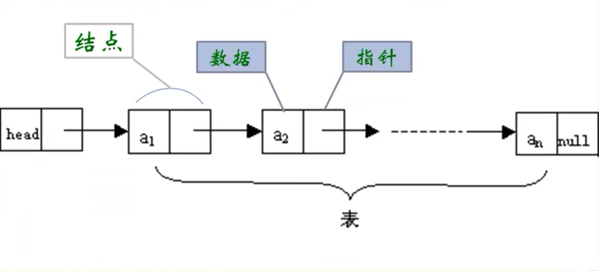

# 线性表

commands:

```c
void test(MyList list){
    list.length = 1;
}

void test(MyList *list){
    (*list).length = 1;
}

void test(MyList *list){
    list->length = 1;
}
```

上面三种写法是一样的。

## 线性表初识

线性表下标**从1开始**。

对线性表进行简单修改：

以下为部分代码

GetElem：代表从线性表中获取第i个元素

LocateElem：判断元素是否在某个线性表中

```C
typdef int Status;
typdef int ElemType;
    
void union(List *La, List Lb){	
	ElemType e;
	int La_len, Lb_len, i;
	La_len = ListLength(*La);
	Lb_len = ListLength(Lb);
	
	for(i = 1; i <= Lb_len; i++){
		GetElem(Lb, i, &e);
		if(!LocateElem(*La, e))
			ListInsert(La, ++La_len, e);
	}
}
```


线性表初始长度一般是不变的，当前长度可能会随着运行而产生变化。

假设每个元素占据c个存储单元，则相邻两个位置存储位置相差为c个存储位置。对于数组而言，$$LOC(i) = LOC(0)+(i-1)\times c$$。

### 获取第i个元素

```c
#define OK 1
#define ERROR 0

Status GetElement(List L, int i, ElemenType *e){
    if( L.length == 0 || i<1 || i > L.length){
        return ERROR;
    }
    return OK;
}//简便起见，直接让获取的元素变成1.
```

### 插入元素

`ListInsert(*L, i, e);`

在第i个位置插入一个新的元素e的方法：（尽量低的时间复杂度）

思路：

* 插入位置不合理，抛出异常
* 长度超出，增加数组容量或者抛出异常
* 从最后一个数组遍历到第i个位置，向后移动。
* 插入元素。

```c
#define MAXSIZE 20
Status ListInsert(SqList *L, int i, ElemType e){
    int k;
    if((*L).Length == MAXSIZE) return ERROR;
    if(i < 1 || i > L->length + 1) return ERROR;
    if(i <= L->length)
        //The element after the i_th will be moved backwards to the next position
        for(k = L->length-1; k>= i-1; k--)
            L->data[k+1] = L->data[k];
    
    L->data[i-1] = e;//insert that element. 
    //Remenber the start index of a linear list is 1 rather than 0 of an array!
    L->length++;
    return OK;
}
```


### 删除

very easy

```c
Status ListInsert(SqList *L, int i, ElemType e){
    int k;
    if(L->Length == 0) return ERROR;
    if(i < 1 || i > L->length) return ERROR;
    
    *e = L->data[i-1]//get the ith element in L
    if(i <= L->length)
        //The element after the i_th will be moved forward 1 position
        for(k = i; k < L->length;  k++)
            L->data[k-1] = L->data[k];
    
    //Remenber the start index of a linear list is 1 rather than 0 of an array!
    L->length;
    return OK;
}
```

若插入/删除的元素在末尾，时间复杂度为o(1)， 最坏的情况是o(n)，平均复杂度也是o(n)。


### conclusion

由于读写时间复杂度为o(1)，插入删除复杂度为o(n)，所以适合读写。


## 链式存储的线性表

线性表的链式存储结构是用一组任意存储单元存储先信标的数据元素。存储数据元素信息的领域称为数据域，存储直接后置位置的领域称为指针域。

每个节点只包含一个指针域的，叫做单链表。



链表的头和尾和其他似乎不一样：头部的指针称为”头指针“，尾部的指针为空指针。

### 单链表存储结构

```C
typdef struct Node{
    ElemType data;//
    struct Node *Next;
}Node;
typedef struct Node* LinkList;
```

