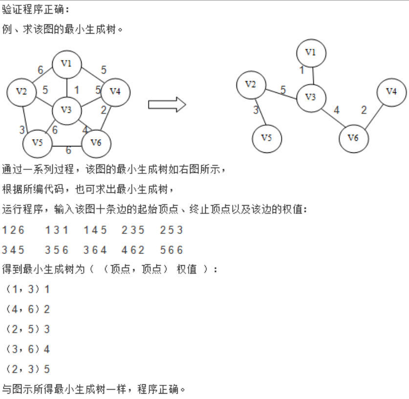
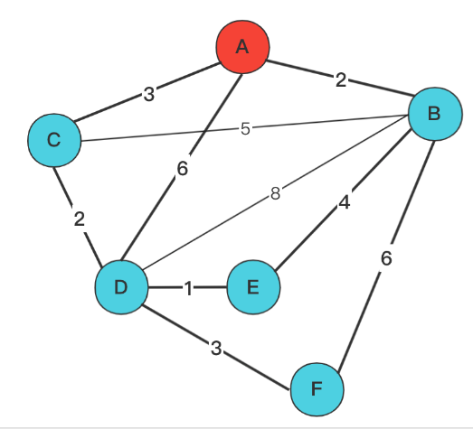

# 最小生成树

## 普利姆算法

```c
```

太难了，略。

## 克鲁斯卡尔算法

 克鲁斯卡尔算法的编程思路是首先要用到辅助数组set，用来存放各顶点所在的最小生成树顶点集合，然后从边集E中顺序取出各条边，**判断该边的两个顶点是否在同一集合中**（需要编写一个判断顶点所在集合的函数seeks），若不在同一集合，则该边为最小生成树的一条边，输出该条边的顶点序列和权值，并在set数组中将顶点v2加到顶点v1集合中，重复以上操作直到所有顶点都在一个集合中结束。

```C
#include<stdio.h>
#define MAX 100
typedef struct{
    int u;//一条边的起始顶点
    int v;//一条边的终止顶点
    int w;
}Edge;
Edge E[MAX];//存储图的各条边
int creatEdge()
{
    int i, anum;
    printf("\n请输入无向网的边数：\n");
    scanf_s("%d", &anum);
    for(i = 0; i < anum; i++)
    {
        printf("输入第%d条边的起始顶点、终止顶点以及其权值（u,v,w):\n", i+1);
        scanf_s("%d %d %d", &E[i].u,&E[i].v, &E[i].w);
    }
    return anum;
}

void swap(int i, int j){
    Edge t = E[i];
    E[i] = E[j];
    E[j] = t;
}

//按照从小到大的权值对Edge数组进行排序 
void sort(int left, int right)
{
    int i, j, pv;
    if(left >= right) return;
    i = left;
    j = right;
    pv = E[i].w;
    while(pv < E[j].w && i < j){
        j--;
    }
    swap(i, j);
    while(pv >= E[i].w && i < j){
        i++;
    }
    swap(i, j);
    sort(left, i-1);
    sort(i+1, right);
}

//寻找v所在的树的根节点
//实质是查找起点和终点最后的位置点。
//例如：set[4,0,1,2,3], v = 4
//这个set中，是从set[0]->set[4]->set[3]->set[2]->set[1]
//其中，set[1]值为0，类比于树中的null结点。
//那么，其上一个就是根节点了。
//经过回溯，慢慢查找到3->2->1->0。
//这个时候，返回的就是set[1]的下标1
int seeks(int set[], int v){
    int i = v;
    //如果这个点是已经放了的 
    while(set[i] > 0){
        i = set[i];
    }
    //如果这个点是没有放的 
    return i;
}

//核心算法
void kruskal(Edge E[], int n){
    int set[MAX];
    int v1, v2, i;
    //初始化set 
    for(i = 0; i < MAX; i++){
        set[i] = 0;
    }
    i = 0;
    while(i < n){
        v1 = seeks(set, E[i].u);//起点 
        v2 = seeks(set, E[i].v);//终点 
        
        if(v1 != v2){//起点不等于终点 ，也就是起点和终点的根节点不在一起否则会形成一个环。
            printf("(%d, %d) %d\n", E[i].u, E[i].v, E[i].w);
            set[v1] = v2;//v1指向v2
        }
        i++;
    }
}

int main(){
    int n;
    n = creatEdge();
    printf("要开始了！！\n");
    if(n > 0){
        sort(0,n-1);
        printf("\n最小生成树为（（顶点，顶点）权值）:\n");
    }else
        printf("ERROE!\n");
    kruskal(E,n);
    return 0;
}
```

可以用这个样例试一试。



# 最短路径

## 迪杰斯特拉算法

基于邻接矩阵的迪杰斯特拉算法



|      | A        | B    | C        | D    | E        | F        |
| ---- | -------- | ---- | -------- | ---- | -------- | -------- |
| A    | 0        | 2    | 3        | 6    | $\infin$ | $\infin$ |
| B    | 2        | 0    | 5        | 8    | 4        | 6        |
| C    | 3        | 5    | 0        | 2    | $\infin$ | $\infin$ |
| D    | 6        | 8    | 2        | 0    | 1        | 3        |
| E    | $\infin$ | 4    | $\infin$ | 1    | 0        | $\infin$ |
| F    | $\infin$ | 6    | $\infin$ | 3    | $\infin$ | 0        |

采用这个类似的例子。构建出的邻接矩阵矩阵将会是：

```c++
vector<vector<int>> dist = {
//	A	B	C	D	E	F
	{0,	2,	3,	6,	max,max	},	//A
    {2,	0,	max,max,4,	6	},	//B
    {3,	max,0,	2,	max,max	},	//C
    {6,	max,2,	0,	1,	3	},	//D
    {max,4,	max,3,	0,	max	},	//E
    {max,6,	max,3,	max,0	}	//F
};
```

其中，下标被定义为：

| 点   | A    | B    | C    | D    | E    | F    |
| ---- | ---- | ---- | ---- | ---- | ---- | ---- |
| 下标 | 0    | 1    | 2    | 3    | 4    | 5    |

例如，我希望从A点开始寻找各点到A点的最短距离。

采用一个`flags`数组，长度为n，用来表示各个点是否被遍历了。例如，`flag[2]`表示下表为2的C点是否有被遍历。

采用一个`distances`数组，用来保存每个点到目标点的距离。例如，`distances[2]`表示下标为2的C点到目标点（例如本题希望的A点）的距离。

```c++
#include<bits/stdc++.h>
using namespace std;
class Dijk {
private:
    int max = (INT_MAX - 1) / 2;
    vector<vector<int>> graph = {
        {0,2,3,6,max,max},
        {2,0,max,max,4,6},
        {3,max,0,2,max,max},
        {6,max,2,0,1,3},
        {max,4,max,3,0,max},
        {max,6,max,3,max,0}
    };
    int size;
public:
    Dijk() {
        this->size = 6;

    }

    int getSize() {
        return this->size;
    }

    Dijk(vector<vector<int>> v) {
        assert(v.size() > 0);
        assert(v.size() == v[0].size());
        this->size = v.size();
        this->graph = v;
    }

    vector<int> findNearestPath(int start) {
        vector<int> distances(size, max);
        vector<int> flags(size, 0);
        vector<int> predecessors(size, -1); // Added to track the predecessors.
        //该点到它自己的距离是0，这将会成为程序的起点。
        distances[start] = 0;
        vector<int> path;
        for (int i = 0; i < size; ++i) {
            int u = -1;
            int minDistance = max;
            //找出除了标记点以外的距离目标点最近的点。
            for (int j = 0; j < size; ++j) {
                //如果j点没有被遍历，并且j点到目标点的距离比当前的最小距离要小，那么更新distance，并更新下标记录点u。
                if (!flags[j] && distances[j] <= minDistance) {
                    minDistance = distances[j];
                    u = j;
                }
            }
            //注意，这轮循环只寻找到目标点最近的点。

            //标记flag[u]，作为已遍历点。
            flags[u] = true;
            //int currentNode = -1;
            //每次找完最近的点，更新图。
            for (int j = 0; j < size; ++j) {
                //条件1：该点没有被遍历过
                //条件2：这个点不是对角线（对角线graph[i][i]表示它自己到自己的距离，恒定是0）
                //条件3：该点到目标点是有解的（distance[i]不是最大值）
                //条件4：原本i点到目标点的距离加上i点到j点的距离小于当前记录中j点到目标点的距离
                //结果：更新j点到目标点的距离
                //j点到当前遍历的u点的距离
                if (!flags[j] && graph[i][j] && distances[i] != max && distances[i] + graph[i][j] < distances[j]) {
                    distances[j] = distances[i] + graph[i][j];
                    //这一步表示，由于u是新找出的距离目标点最近的点，集合外的点j到其前一个距离目标点最近的点也应当得到更新。这个点就是u。
                    predecessors[j] = u;
                }
            }
            //path.puahs_back(currentNode);
        }
        //print
        for (int i = 0; i < size; ++i) {
            cout << i << "\t" << distances[i] << "\t";
            // Reconstruct and print the path.
            int current = i;
            string path = "";
            while (current != -1) {
                path = to_string(current) + (path.length() > 0 ? " <- " : "") + path;
                current = predecessors[current];
            }
            cout << path << endl;
        }
        return distances;
    }

    void printDist() {
        int size = graph.size();
        for (int i = 0; i < size; i++) {
            for (int j = 0; j < size; j++) {
                printf("结点%d到%d的最短路径为：%d\n", i + 1, j + 1, graph[i][j]);
            }
        }
    }
};

int main() {
    Dijk d;
    d.findNearestPath(0);
    return 0;
}
```


## 弗洛伊德算法

c太复杂了，使用C++。


|      | A        | B    | C        | D    | E        | F        |
| ---- | -------- | ---- | -------- | ---- | -------- | -------- |
| A    | 0        | 2    | 3        | 6    | $\infin$ | $\infin$ |
| B    | 2        | 0    | 5        | 8    | 4        | 6        |
| C    | 3        | 5    | 0        | 2    | $\infin$ | $\infin$ |
| D    | 6        | 8    | 2        | 0    | 1        | 3        |
| E    | $\infin$ | 4    | $\infin$ | 1    | 0        | $\infin$ |
| F    | $\infin$ | 6    | $\infin$ | 3    | $\infin$ | 0        |


```c++
#include<stdio.h>
#include<bits/stdc++.h>
using namespace std;

class Floyd{
private:
    int max = (INT_MAX-1)/2;
    vector<vector<int>> dist = {
        {0,2,3,6,max,max},
        {2,0,max,max,4,6},
        {3,max,0,2,max,max},
        {6,max,2,0,1,3},
        {max,4,max,3,0,max},
        {max,6,max,3,max,0}
    };
public:
    Floyd(){
        
    }
    
    Floyd(vector<vector<int>>&v){
        this->dist = v;
    }
    
    void updateDist(){
        int size = dist.size();
        for(int k = 0; k < size; k++){
            for(int i = 0; i < size; i++){
                for(int j = 0; j < size; j++){
                    //取dist[i][j]与dist[i][k]+dist[k][j]的最小值给dist[i][j]
                    if(dist[i][j] > dist[i][k]+dist[k][j]){
                        dist[i][j] = dist[i][k]+dist[k][j];
                    }
                }
            }
        }
    }
    
    void printDist(){
        int size = dist.size();
        for(int i = 0; i < size; i++){
            for(int j = 0; j < size; j++){
            	printf("结点%d到%d的最短路径为：%d\n", i+1,j+1, dist[i][j]);
            }
        }
    }
};

int main(){
    Floyd f;
    f.updateDist();
    f.printDist();
    return 0;
}
```


